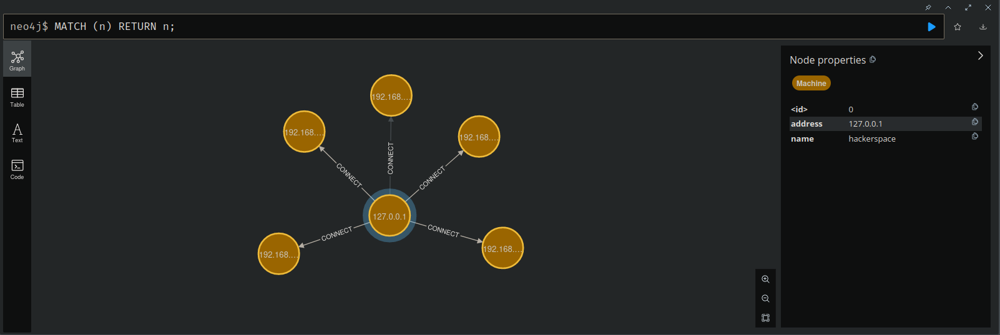
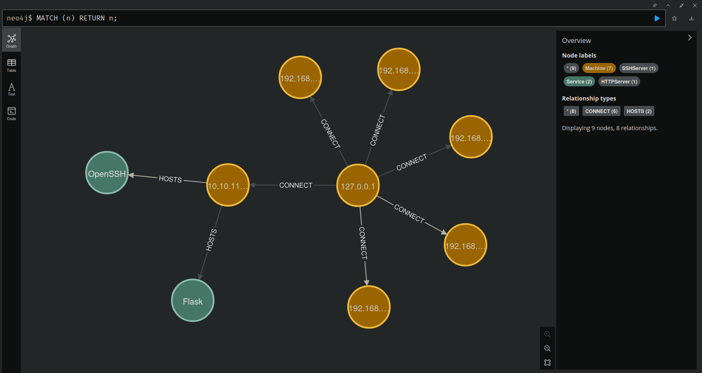

# Hades

> A Proof-Of-Concept for a colaborative Pentest framework. 

Hades is an web-based application designed to centralize all information gathered during security penetration testing. It employs Nodes to represent hosts, services and vulnerabilities, all interconnected by edges. The primary objective is to create a real-time collaborative platform akin to [Miro](https://miro.com/), enabling Pentesters to initiate shared sessions and seamlessly store valuable data concerning the infrastructure, network, services, and vulnerabilities.

This repo contains a Proof-Of-Concept (PoC) to the backend Hades server. 

## Installation

1. Start the Neo4J with docker:

```shell
docker run -p 7474:7474 -p 7687:7687 neo4j:latest
```

2. Access the <a href="http://localhost:7474/" target=_blank>web interface</a> and login with `neo4j:neo4j`. The server will ask for a new password.

3. Create a virtual environment:

```shell
mkdir Hades && cd Hades
python3 -m venv .
```

4. Clone this repository

```shell
git clone https://github.com/entr0pie/Hades src && cd src
```

5. Create a new .env file. Insert the password you provided earlier:

```
NEO4J_USERNAME=neo4j
NEO4J_PASSWORD=<YOUR-NEW-PASSWORD-HERE>
NEO4J_ADDRESS=localhost
NEO4J_BOLT_PORT=7687
``` 

6. Install the requirements:

```shell
pip install -r requirements.txt
```

7. Login as root and activate the virtual env:

```shell
su root
source ../bin/activate
```

8. Finally, start the server:

```shell
python3 hades.py
```

## Demonstration

### Scanning the Local Network

To scan the local network, just request the `/netscan` route:

```shell
curl http://localhost:8000/netscan
```

Result in Neo4J:



### Scanning for open ports

To search for services on a machine, request the `/portscan/tcp/syn` route:

```shell
curl http://localhost:8000/portscan/tcp/syn/10.10.11.208
```

Result in Neo4J:




## License 

This project is under [MIT License](LICENSE).